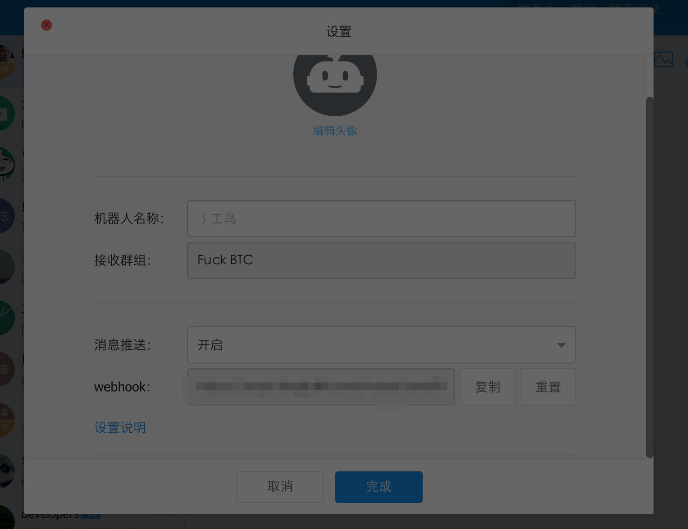

# FuckBtc
btc watch dog

## Folder 
- release 
artifacts
- library 
source code

## Dependencies
```groovy
    compile 'io.reactivex:rxjava:1.0.14'
    compile 'com.squareup.retrofit:retrofit:2.0.0-beta1'
    compile 'com.squareup.retrofit:converter-gson:2.0.0-beta2'
    compile 'com.squareup.retrofit:adapter-rxjava:2.0.0-beta2'
    compile 'com.squareup.okhttp:okhttp:2.4.0'
    compile 'com.squareup.okio:okio:1.6.0'
```

## How to use

1. clone the repo

2. 
```
cd repo_dir/release
```

3. Use [DingDing](https://www.dingtalk.com/) to create a robot and copy webhook



Note that you may get the following url
```
https://oapi.dingtalk.com/robot/send?access_token=c68b777981a8cfe320497d199c0c744f113e5984f9b4c2b7dc6d5cc
```

modify fuck.config and add:
```
DING_WEB_HOOK=c68b777981a8cfe320497d199c0c744f113e5984f9b4c2b7dc6d5cc
```

4. go to [huobi](https://www.huobi.com/account/account.php?a=show) and get api key


copy api key and api secret key then modify fuck.config
```
HUO_BI_ACCESS_KEY=your api key
HUO_BI_SECRET_KEY=your api secret key
```

5. run 
```
./fuck.sh
```

## User Define


In fuck btc we support the following settings

```
BTC_MAX_DURATION=20000
ETH_MAX_DURATION=20000
HEART_BEAT_INTERVAL=300000
# big transaction threshold
BTC_WARNING_THRESHOLD=10
ETH_WARNING_THRESHOLD=100
HUO_BI_ACCESS_KEY=8299a236f-17ec3-8b7fa980-1f1d3
HUO_BI_SECRET_KEY=342e59-a8bfd7b7-aa530-407ff
VERSION=1.0.0
DING_WEB_HOOK=c68b7779c9154c738cfe320497d199c0c744f113e5984f9b4c2b7dc6d5cc
```